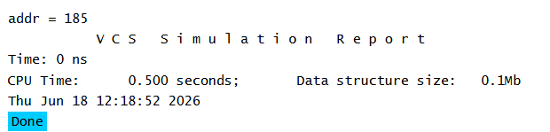

# UVM Base Classes - uvm_object Basic Example

## Objective

The objective of this example is to understand the fundamentals of `uvm_object`, which is the base class for all data objects in UVM.

This is the first step in learning UVM and understanding how transactions are represented in a verification environment.

---

## Concepts Covered

- UVM Package Import
- `uvm_object`
- UVM Factory
- Factory Registration
- `type_id::create()`
- Constructor
- Randomization

---

## What is uvm_object?

`uvm_object` is the base class for all non-hierarchical data objects in UVM.

Examples of classes that typically extend `uvm_object`:

- Transactions
- Packets
- Sequence Items
- Sequences

A class derived from `uvm_object` automatically inherits useful methods such as:

- `print()`
- `copy()`
- `clone()`
- `compare()`

These methods help in debugging, copying, comparing, and managing UVM objects.

---

## Class Hierarchy

```text
uvm_void
   |
uvm_object
   |
packet
```

In this example, the `packet` class inherits all capabilities provided by `uvm_object`.

---

## Understanding the Example

### UVM Package

The UVM package provides all standard UVM classes, methods, macros, and utilities required to build a UVM testbench.

---

### Creating a UVM Object

The `packet` class is derived from `uvm_object`.

By extending `uvm_object`, the class becomes a UVM data object and gains access to factory support and several built-in utility methods.

---

### Randomizable Variables

The address field is declared as a random variable.

When object randomization is performed, the simulator automatically generates a random value for the field.

---

### Factory Registration

The packet class is registered with the UVM Factory.

Factory registration enables:

- Factory-based object creation
- Object substitution
- Factory overrides
- Improved testbench reusability

Without factory registration, factory creation methods cannot be used.

---

### Factory-Based Object Creation

UVM recommends creating objects through the factory instead of directly using `new()`.

Factory creation improves flexibility because object types can be replaced without modifying existing testbench code.

---

### Object Randomization

After creating the object, randomization is performed.

The simulator generates a random value for all variables declared using the `rand` keyword.

---

## Simulation Output



## Key Takeaways

- `uvm_object` is the foundation of all UVM data objects.
- Transactions and sequence items are typically derived from `uvm_object`.
- Factory registration is required for factory-based object creation.
- UVM prefers factory creation over direct object construction.
- Randomization in UVM uses standard SystemVerilog randomization.
- Understanding `uvm_object` is essential before learning sequence items, sequences, drivers, monitors, and agents.

---

## Reference

https://chipverify.com/uvm/base-classes

-