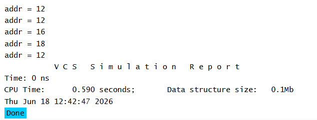

# UVM Base Classes - uvm_object Randomization Example

## Objective

The objective of this example is to understand how randomization and constraints work in a class derived from `uvm_object`.

This example demonstrates constrained random stimulus generation, one of the most important concepts used in UVM-based verification.

---

## Concepts Covered

- `uvm_object`
- Random Variables
- Constraints
- Constrained Randomization
- UVM Factory
- `type_id::create()`

---

## What is Constrained Randomization?

Constrained randomization is a verification technique where random values are generated while satisfying user-defined rules called constraints.

Instead of generating completely random values, the simulator generates values that obey the specified constraints.

This helps create valid and meaningful test scenarios while still providing randomness.

---

## Understanding the Example

### Random Variable

The address field is declared as a random variable.

During randomization, the simulator automatically assigns a value to this field.

---

### Constraint

A constraint is applied to the address field.

The constraint restricts the generated address value to the range:

```text
10 to 20
```

As a result, every randomized value must satisfy this condition.

---

### Factory-Based Object Creation

The packet object is created using the UVM factory.

Factory-based creation is preferred in UVM because it improves flexibility and supports object overrides.

---

### Multiple Randomization Calls

The object is randomized five times using a repeat loop.

For every iteration:

1. A new random value is generated.
2. The constraint is checked.
3. The value is displayed.

Although the values change from run to run, they always remain within the constrained range.

---

## Class Hierarchy

```text
uvm_void
   |
uvm_object
   |
packet
```

The `packet` class inherits all capabilities provided by `uvm_object`.

---

## Simulation Output



**Note:** The exact values may vary in every simulation run. However, all generated values will always be within the range specified by the constraint.

---

## Key Takeaways

- Variables declared with `rand` can be randomized.
- Constraints restrict the values generated during randomization.
- Constrained randomization is a fundamental verification technique.
- UVM uses standard SystemVerilog randomization and constraint mechanisms.
- Factory-based object creation is preferred over direct object construction.
- Constrained random stimulus helps improve verification coverage while maintaining valid test scenarios.

---

## Reference

https://chipverify.com/uvm/base-classes
