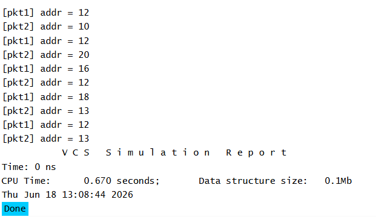

# UVM Base Classes - Factory Create Example

## Objective

Understand how the UVM Factory creates objects using
`type_id::create()` and why UVM prefers factory-based object creation over direct construction using `new()`.

## Concepts Covered

- UVM Factory
- Factory Registration
- `uvm_object_utils`
- `type_id::create()`
- Object Naming
- Factory-Based Object Creation

## What is the UVM Factory?

The UVM Factory is a centralized mechanism used to create objects and components.

Instead of directly constructing objects using `new()`, UVM recommends creating them through the factory.

This approach improves flexibility, reusability, and supports factory overrides.

## Factory Registration

Classes must be registered with the factory before they can be created using `type_id::create()`.

Factory registration is performed using utility macros.

## Object Creation

The packet object is created through the UVM Factory.

The string passed to `create()` becomes the object's name.

## Simulation Output

## Key Takeaways

- UVM prefers factory-based creation over direct object construction.
- Factory registration is required before using `type_id::create()`.
- Objects can be created dynamically through the factory.
- Factory creation enables future object overrides without modifying existing code.

## Reference

https://chipverify.com/uvm/base-classes

