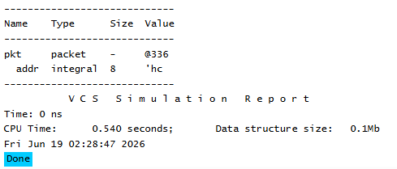

# UVM Base Classes - Field Automation Macros Example 
## Objective 
The objective of this example is to understand UVM field automation macros and how they enable  automatic operations such as printing, copying, comparing, packing, and unpacking object fields. 
This example demonstrates how UVM can automatically recognize and process class members once  they are registered using field macros. 
--- 
## Concepts Covered 
- UVM Field Automation 
- `uvm_object_utils_begin` 
- `uvm_object_utils_end` 
- `uvm_field_int` 
- Automatic Field Registration 
- UVM Print Mechanism 
- `UVM_ALL_ON` 
--- 
## What are UVM Field Macros? 
By default, UVM does not automatically know which class members should participate in operations  such as: 
- `print()` 
- `copy()` 
- `clone()` 
- `compare()` 
- `pack()` 
- `unpack()` 
Field macros are used to register class members with the UVM automation mechanism. Once a field is registered, UVM can automatically include that field in supported operations. --- 
## Understanding the Example 
### Field Registration 
The `addr` variable is registered using a field automation macro. 
This informs UVM that the field should participate in automated operations. --- 
### UVM_ALL_ON 
The `UVM_ALL_ON` flag enables all supported automation features for the registered field.  Daily Notes Page 13 

The `UVM_ALL_ON` flag enables all supported automation features for the registered field. These include: 
- Printing 
- Copying 
- Comparing 
- Packing 
- Unpacking 
- Recording 
--- 
### Automatic Printing 
After the object is randomized, the `print()` method is called. 
Because the field is registered with UVM, the value of `addr` is automatically displayed in the print  output. 
Without field registration, UVM would not know that `addr` should be included in the output. --- 
## Class Hierarchy 
```text 
uvm_void 
 | 
uvm_object 
 | 
packet 
``` 
The `packet` class inherits all functionality provided by `uvm_object`. 
--- 
## Simulation Output 
 
--- 
## Key Takeaways 
- UVM does not automatically process class members. 
- Field macros register variables with the UVM automation mechanism. 
- `uvm_field_int` is used for integral data types. 
- `UVM_ALL_ON` enables all supported automation features. 
- Registered fields automatically participate in print, copy, compare, pack, and unpack operations. - Field automation simplifies verification code and reduces manual implementation effort. 
--- 
## Reference 
https://chipverify.com/uvm/base-classes


