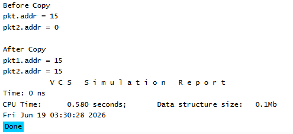

# UVM Base Classes - copy() Example
## Objective
The objective of this example is to understand how the UVM `copy()` method copies data from one
object to another.
This example demonstrates how UVM can automatically copy registered fields between objects
using field automation macros.
---
## Concepts Covered
- `uvm_object`
- Field Automation
- `uvm_field_int`
- `copy()`
- Object-to-Object Data Transfer
---
## What is copy()?
The `copy()` method is a built-in UVM utility function that copies data from one object to another.
Instead of manually assigning each variable, UVM automatically copies all registered fields.
This simplifies object handling and reduces repetitive code.
---
## Understanding the Example
Two packet objects are created:
- `pkt1`
- `pkt2`
Initially:
- `pkt1.addr` is assigned a value of 15.
- `pkt2.addr` remains at its default value.
The statement:
```text
pkt2.copy(pkt1);
```
copies all registered fields from `pkt1` into `pkt2`.
After the copy operation, both objects contain the same field values.
---
## Why Field Automation Matters
The `copy()` method only works on fields registered using field automation macros.
Since the `addr` field is registered, UVM automatically knows that it should be copied.
Without field registration, UVM would not know which class members should participate in the copy
operation.
---
## Class Hierarchy
```text
uvm_void
|
uvm_object
|
packet
```
The `packet` class inherits all functionality provided by `uvm_object`.
---
## Simulation Output

---
## Key Takeaways
- `copy()` is a built-in UVM utility method.
- It copies registered fields from one object to another.
- Field automation macros enable automatic copy functionality.
- Manual field-by-field assignment is not required.
- `copy()` is commonly used while handling transactions in verification environments.
---
## Reference
https://chipverify.com/uvm/base-classes    


