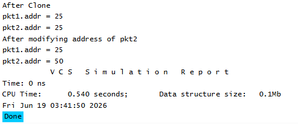

# UVM Base Classes - clone() Example
## Objective
The objective of this example is to understand how the UVM `clone()` method creates a new object
and copies all registered fields from the original object.
This example demonstrates object duplication using UVM field automation.
---
## Concepts Covered
- `uvm_object`
- Field Automation
- `uvm_field_int`
- `clone()`
- `$cast`
- Object Duplication
---
## What is clone()?
The `clone()` method is a built-in UVM utility function that creates a new object and copies all
registered fields from the source object.
Unlike `copy()`, the destination object does not need to be created beforehand.
The clone operation performs:
1. Object creation
2. Data copying
in a single step.
---
## Understanding the Example
A packet object named `pkt1` is created and assigned an address value.
The `clone()` method is then used to create a duplicate object.
The cloned object contains the same field values as the original object.
After cloning, the address field of the cloned object is modified.
The simulation shows that changing the cloned object does not affect the original object, proving
that both objects are independent.
---
## clone() vs copy()
### copy()
Copies data from one existing object to another existing object.
```text
pkt1 ---> pkt2
```
Both objects must already exist.
---
### clone()
Creates a new object and copies data into it.
```text
pkt1 ---> clone() ---> pkt2
```
The destination object is automatically created.
---
## Why is $cast Used?
The `clone()` method returns a handle of type `uvm_object`.
Since `pkt2` is declared as a `packet`, `$cast` is required to convert the returned object into the
appropriate type.
---
## Class Hierarchy
```text
uvm_void
|
uvm_object
|
packet
```
The `packet` class inherits all functionality provided by `uvm_object`.
---
## Simulation Output

---
## Key Takeaways
- `clone()` creates a new object and copies all registered fields.
- The cloned object is independent of the original object.
- Modifying the cloned object does not affect the original object.
- `$cast` is commonly used because `clone()` returns a `uvm_object`.
- Field automation macros enable automatic cloning of registered fields.
- `clone()` combines object creation and data copying into a single operation.
---
## Reference
https://chipverify.com/uvm/base-classes

