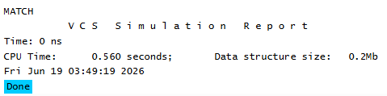

# UVM Base Classes - compare() Example
## Objective
The objective of this example is to understand how the UVM `compare()` method compares
registered fields between two objects.
This example demonstrates automatic object comparison using UVM field automation.
---
## Concepts Covered
- `uvm_object`
- Field Automation
- `uvm_field_int`
- `compare()`
- Object Comparison
---
## What is compare()?
The `compare()` method is a built-in UVM utility function used to compare registered fields between
two objects.
Instead of manually comparing each field one by one, UVM automatically compares all registered
fields and returns the result.
---
## Understanding the Example
Two packet objects are created using the UVM factory.
Both objects are assigned the same value for the address field.
The `compare()` method is then used to check whether the registered fields in both objects match.
Since both objects contain the same address value, the comparison succeeds and the simulation
displays a match.
---
## Why Field Automation Matters
The `compare()` method only compares fields that are registered using field automation macros.
Field registration informs UVM which class members should participate in comparison operations.
Without field registration, UVM would not know which fields need to be compared.
---
## Class Hierarchy
```text
uvm_void

uvm_void
|
uvm_object
|
packet
```
The `packet` class inherits all functionality provided by `uvm_object`. 
---
## Simulation Output

---
## Key Takeaways
- `compare()` is a built-in UVM utility method.
- Registered fields are automatically compared.
- Field automation macros enable automatic comparison functionality.
- The method returns a match when all registered fields contain the same values.
- `compare()` simplifies transaction checking and validation.
- `compare()` is commonly used in scoreboards to compare expected and actual transactions.
---  
## Reference
https://chipverify.com/uvm/base-classes


