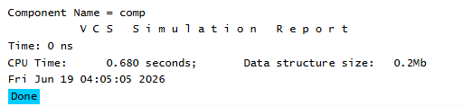

# UVM Components - Basic Component Example
## Objective
The objective of this example is to understand the fundamentals of
`uvm_component`, the base class for all UVM testbench components.
This example demonstrates component creation, factory registration, and
hierarchical construction.
---
## Concepts Covered
- `uvm_component`
- Component Registration
- `uvm_component_utils`
- Component Constructor
- Parent-Child Hierarchy
- Factory Creation
- `get_name()`
---
## What is uvm_component?
`uvm_component` is the base class for all hierarchical testbench components
in UVM.
Common examples include:
- Driver
- Monitor
- Agent
- Environment (Env)
- Test
- Scoreboard
Unlike `uvm_object`, components participate in the UVM phase mechanism
and are organized in a hierarchy.
---
## Understanding the Example
A simple component named `my_component` is created by extending
`uvm_component`.
The component is registered with the UVM factory using the component
utility macro.
The component is then created through the factory and its name is displayed
using the `get_name()` method.
---
## Component Constructor
Unlike `uvm_object`, every `uvm_component` requires two constructor
arguments:
1. Component name
2. Parent component handle
The parent handle allows UVM to build a hierarchical testbench structure.
In this example, the parent is set to `null` because the component is created
as a top-level component.
---
## Factory Registration
The component is registered with the UVM factory using:

```text
`uvm_component_utils(my_component)
```
Factory registration enables factory-based component creation and future
component overrides.
---
## Factory-Based Creation
The component is created using:
```text
my_component::type_id::create()
```
UVM recommends factory-based creation because it improves flexibility and
reusability.
---
## Class Hierarchy
```text
uvm_void
|
uvm_object
|
uvm_report_object
|
uvm_component
|
my_component
```
The `my_component` class inherits all functionality provided by
`uvm_component`.
---
## Simulation Output

---
## Key Takeaways
- `uvm_component` is the base class for all UVM testbench components.
- Components are created through the UVM factory.
- Components belong to a hierarchy through parent-child relationships.
- Every component constructor requires a name and a parent handle.
- Components participate in the UVM phase mechanism.
- Drivers, monitors, agents, environments, and tests are all derived from
`uvm_component`.
---