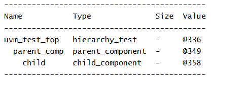

# UVM Components - Component Hierarchy Example
## Objective

The objective of this example is to understand how UVM components are organized into a parent-
child hierarchy.

This example demonstrates how components are created during the build phase and how UVM
automatically maintains hierarchical relationships between components.
---
## Concepts Covered
- `uvm_component`
- `uvm_test`
- Component Hierarchy
- Parent-Child Relationship
- `build_phase`
- `end_of_elaboration_phase`
- `print_topology()`
- Factory-Based Component Creation
---
## What is Component Hierarchy?
One of the most important concepts in UVM is component hierarchy.
Unlike `uvm_object`, components are not standalone objects. Every component belongs to a
hierarchy and can have:
- A parent component
- Child components
This hierarchical structure allows UVM to manage complex verification environments efficiently.
---
## Understanding the Example
Three components are created:
### hierarchy_test
Acts as the top-level UVM test.
### parent_component
Created inside the test during the build phase.
### child_component
Created inside the parent component during the build phase.
As a result, the following hierarchy is formed:
```text
uvm_test_top
|
+-- parent_comp
|
+-- child
```

---
## Parent-Child Relationship
When a component is created using:
```text
create("child", this)
```
the second argument (`this`) becomes the parent of the newly created component.
This establishes the parent-child relationship within the UVM hierarchy.
---
## build_phase
The `build_phase()` is commonly used to create components.
During this phase:
- The test creates the parent component.
- The parent component creates the child component.
UVM automatically builds the hierarchy as components are created.
---
## end_of_elaboration_phase
The `end_of_elaboration_phase()` executes after the hierarchy has been fully constructed.
The method:
```text
uvm_top.print_topology()
```
prints the complete UVM hierarchy.
This is useful for verifying that all components were created correctly.
---
## Class Hierarchy
```text
uvm_void
|
uvm_object
|
uvm_report_object
|
uvm_component
|
+-- uvm_test
| |
| +-- hierarchy_test
|
+-- parent_component
|
+-- child_component
```

---
## Generated UVM Hierarchy
```text
uvm_test_top
|
+-- parent_comp
|
+-- child
```

---
## Simulation Output

---
## Key Takeaways
- UVM components are organized in a hierarchy.
- Every component can have a parent and child components.
- Components are typically created during the `build_phase`.
- Passing `this` during component creation establishes the parent-child relationship.
- `print_topology()` displays the complete hierarchy.
- The hierarchy forms the foundation of every UVM testbench.
---
