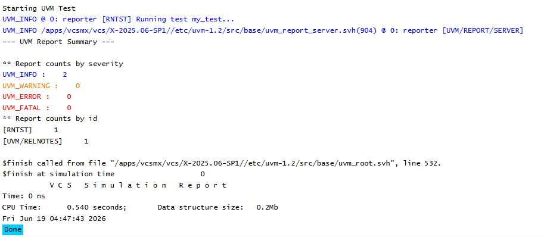

# UVM Components - UVM Testbench Top Example
## Objective
The objective of this example is to understand the role of the UVM Testbench Top and how a UVM
test is started using `run_test()`.
This example demonstrates the relationship between the top-level SystemVerilog module and the
UVM test class.
---
## Concepts Covered
- UVM Testbench Top
- `uvm_test`
- `run_test()`
- UVM Factory
- Top-Level Module
---
## What is UVM Testbench Top?
The UVM Testbench Top is the top-level SystemVerilog module that serves as the entry point for
simulation.
It is responsible for:
- Starting the UVM test
- Instantiating the DUT (in real projects)
- Instantiating interfaces
- Generating clocks and resets
The top-level module acts as the bridge between the hardware design and the UVM verification
environment.
---
## Understanding the Example
A simple test named `my_test` is created by extending `uvm_test`.
The test is registered with the UVM factory and started from the top-level module using:
```text
run_test("my_test")
```
When simulation begins, UVM creates the test object and starts the UVM phase execution process.
---
## How run_test() Works
The statement:
```text
run_test("my_test")
```
instructs UVM to:
1. Locate the registered test named `my_test`
2. Create the test using the UVM factory
3. Execute the UVM phase mechanism
This is the standard way to start a UVM test.
---
## Testbench Structure
```text
tb
|
+-- run_test("my_test")
|
+-- my_test
```
In a real verification environment:
```text
tb_top
|
+-- DUT
|
+-- Interface
|
+-- run_test()
|
+-- Test
|
+-- Environment
|
+-- Agent
```

---
## Why is the Testbench Top a Module?
The testbench top must be a SystemVerilog module because only modules can instantiate hardware
components such as:
- DUTs
- Interfaces
- Clocks
- Reset logic
UVM classes provide verification functionality, while the top-level module connects the verification
environment to the design under test.
---
## Simulation Output

---
## Key Takeaways
- Every UVM simulation starts from a top-level module.
- The top-level module is commonly called `tb` or `tb_top`.
- `run_test()` starts a UVM test.
- Tests are created through the UVM factory.
- The top-level module connects the hardware world to the UVM verification world.
- Real projects instantiate DUTs and interfaces inside the testbench top.
---
