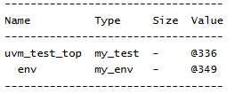

# UVM Components - UVM Environment Example
## Objective
The objective of this example is to understand the role of `uvm_env` in a UVM verification
environment.
This example demonstrates how a test creates an environment and how UVM builds a hierarchical
verification structure.
---
## Concepts Covered
- `uvm_env`
- `uvm_test`
- Environment Creation
- `build_phase`
- `end_of_elaboration_phase`
- UVM Hierarchy
- Factory-Based Component Creation
---
## What is uvm_env?
`uvm_env` is a container component used to organize and group related verification components.
A typical UVM environment may contain:
- Agents
- Scoreboards
- Coverage Collectors
- Reference Models
The environment acts as the central container for the verification architecture.
---
## Understanding the Example
A custom environment named `my_env` is created by extending `uvm_env`.
A test named `my_test` is created by extending `uvm_test`.
During the build phase, the test creates the environment using factory-based creation.
After the hierarchy is built, `print_topology()` is used to display the complete UVM hierarchy.
---
## Hierarchy Created
```text
uvm_test_top
|
+-- env
```
The environment becomes a child component of the test.
---
## build_phase()
The `build_phase()` is commonly used to create UVM components.
In this example, the environment is created during the build phase and attached to the test
hierarchy.
---
## end_of_elaboration_phase()
The `end_of_elaboration_phase()` executes after all components have been created.
The method:
```text
uvm_top.print_topology()
```
prints the complete UVM hierarchy and helps verify that all components were instantiated correctly.
---
## Why Use an Environment?
Without an environment:
```text
my_test
|
+-- driver
+-- monitor
+-- scoreboard
```
With an environment:
```text
my_test
|
+-- env
|
+-- driver
+-- monitor
+-- scoreboard
```
The environment improves organization, modularity, and reusability.
---
## Class Hierarchy
```text
uvm_void
|
uvm_object
|
uvm_report_object
|
uvm_component
|
+-- uvm_test
| |
| +-- my_test
|
+-- uvm_env
|
+-- my_env
```

---
## Simulation Output

---
## Key Takeaways
- `uvm_env` is a container for verification components.
- Tests typically create environments during the build phase.
- Environments help organize verification architecture.
- The environment becomes a child of the test component.
- `print_topology()` can be used to visualize the hierarchy.
- Most UVM testbenches contain one or more environments.
---