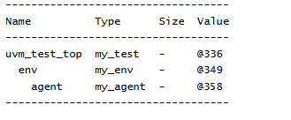

# UVM Components - UVM Agent Example
## Objective
The objective of this example is to understand the role of `uvm_agent` in a UVM verification
environment.
This example demonstrates how an environment creates an agent and how UVM builds a
hierarchical verification structure.
---
## Concepts Covered
- `uvm_agent`
- `uvm_env`
- `uvm_test`
- Agent Creation
- `build_phase`
- UVM Hierarchy
- Active Agent
- Passive Agent
---
## What is uvm_agent?
`uvm_agent` is a container component used to group protocol-specific verification components.
A typical agent may contain:
- Driver
- Monitor
- Sequencer
The agent represents a protocol interface and provides a reusable verification block.
---
## Understanding the Example
A custom agent named `my_agent` is created by extending `uvm_agent`.
A custom environment named `my_env` is created by extending `uvm_env`.
The environment creates the agent during the build phase, and the test creates the environment
during its build phase.
After all components are constructed, the hierarchy is displayed using `print_topology()`.
---
## Hierarchy Created
```text
uvm_test_top
|
+-- env
|
+-- agent
```
The environment becomes a child of the test, and the agent becomes a child of the environment.
---
## build_phase()
The `build_phase()` is commonly used to create UVM components.
In this example:
- The test creates the environment.
- The environment creates the agent.
UVM automatically builds the hierarchy based on the parent-child relationships.
---
## Active vs Passive Agent
### Active Agent
```text
Agent
|
+-- Driver
+-- Sequencer
+-- Monitor
```
An active agent can generate and drive stimulus to the DUT.
---
### Passive Agent
```text
Agent
|
+-- Monitor
```
A passive agent only observes DUT activity and does not drive signals.
---
## Why Use Agents?
Without agents:
```text
env
|
+-- driver
+-- monitor
+-- sequencer
```
With agents:
```text
env
|
+-- apb_agent
|
+-- axi_agent
|
+-- uart_agent
```
Agents improve organization, modularity, and reusability.
---
## Class Hierarchy
```text
uvm_void
|
uvm_object
|
uvm_report_object
|
uvm_component
|
+-- uvm_test
| |
| +-- my_test
|
+-- uvm_env
| |
| +-- my_env
|
+-- uvm_agent
|
+-- my_agent
```

---
## Simulation Output

---
## Key Takeaways
- `uvm_agent` groups protocol-specific verification components.
- Agents are usually created inside environments.
- Agents become child components of environments.
- Active agents can generate stimulus.
- Passive agents only observe DUT activity.
- Agents improve reusability and organization of verification environments.
---