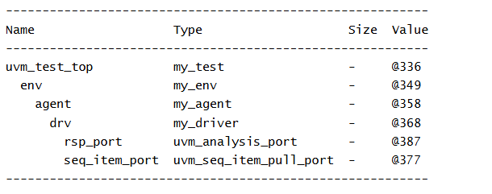

# UVM Components - UVM Driver Example

## Objective

The objective of this example is to understand the role of `uvm_driver` in a UVM verification environment.

This example demonstrates how an agent creates a driver and how UVM builds a hierarchical verification structure.

---

## Concepts Covered

- `uvm_driver`
- `uvm_agent`
- `uvm_env`
- `uvm_test`
- Driver Creation
- `build_phase`
- UVM Hierarchy

---

## What is uvm_driver?

`uvm_driver` is responsible for converting high-level transactions into signal-level activity on the DUT interface.

The driver acts as the bridge between transaction-level stimulus and hardware signals.

In a complete UVM environment, the driver receives transactions from a sequencer and drives the corresponding signals onto the DUT interface.

---

## Understanding the Example

A custom driver named `my_driver` is created by extending `uvm_driver`.

A custom agent named `my_agent` is created by extending `uvm_agent`.

The agent creates the driver during the build phase.

The environment creates the agent, and the test creates the environment.

After all components are created, the hierarchy is displayed using `print_topology()`.

---

## Hierarchy Created

```text
uvm_test_top
     |
     +-- env
            |
            +-- agent
                   |
                   +-- drv
```

The driver becomes a child component of the agent.

---

## build_phase()

The `build_phase()` is commonly used to create UVM components.

In this example:

- The test creates the environment.
- The environment creates the agent.
- The agent creates the driver.

UVM automatically builds the hierarchy based on the parent-child relationships.
---

## Why Do We Need Drivers?

The driver is responsible for driving DUT signals.

Transaction Flow:

```text
Sequence Item
      |
      v
   Driver
      |
      v
 DUT Signals
```

Without a driver, transactions cannot be translated into signal activity on the DUT interface.

---

## Class Hierarchy

```text
uvm_void
   |
uvm_object
   |
uvm_report_object
   |
uvm_component
   |
   +-- uvm_test
   |      |
   |      +-- my_test
   |
   +-- uvm_env
   |      |
   |      +-- my_env
   |
   +-- uvm_agent
   |      |
   |      +-- my_agent
   |
   +-- uvm_driver
          |
          +-- my_driver
```

---

## Simulation Output



---

## Key Takeaways

- `uvm_driver` drives DUT signals.
- Drivers are typically created inside agents.
- Drivers become child components of agents.
- Drivers receive transactions from sequencers.
- Drivers convert transactions into signal-level activity.
- Drivers form the bridge between transaction-level and signal-level verification.

---

