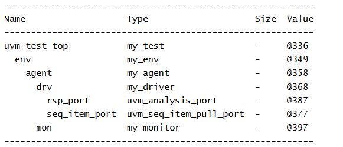

# UVM Components - UVM Monitor Example

## Objective

The objective of this example is to understand the role of `uvm_monitor` in a UVM verification environment.

This example demonstrates how an agent creates both a driver and a monitor, and how UVM builds a hierarchical verification structure.

---

## Concepts Covered

- `uvm_monitor`
- `uvm_driver`
- `uvm_agent`
- `uvm_env`
- `uvm_test`
- Monitor Creation
- Driver vs Monitor
- UVM Hierarchy

---

## What is uvm_monitor?

`uvm_monitor` is a passive component used to observe DUT activity.

The monitor samples DUT signals, reconstructs transactions from those signals, and forwards the transactions to other verification components such as scoreboards and coverage collectors.

Unlike a driver, a monitor never drives signals onto the DUT.

---

## Understanding the Example

A custom monitor named `my_monitor` is created by extending `uvm_monitor`.

A custom driver named `my_driver` is created by extending `uvm_driver`.

The agent creates both the driver and monitor during the build phase.

The environment creates the agent, and the test creates the environment.

After all components are created, the hierarchy is displayed using `print_topology()`.

---

## Hierarchy Created

```text
uvm_test_top
     |
     +-- env
            |
            +-- agent
                   |
                   +-- drv
                   |
                   +-- mon
```

The driver and monitor become child components of the agent.

---

## Typical Data Flow

```text
Sequence
    |
    v
 Driver
    |
    v
  DUT
    |
    v
 Monitor
    |
    v
Scoreboard / Coverage
```

The driver sends transactions to the DUT, while the monitor observes DUT activity and reconstructs transactions.

---

## Why Do We Need a Monitor?

Monitors allow verification components to observe DUT behavior without affecting it.

The transactions generated by the monitor can be used for:

- Scoreboarding
- Functional Coverage
- Protocol Checking
- Debugging

---

## Class Hierarchy

```text
uvm_void
   |
uvm_object
   |
uvm_report_object
   |
uvm_component
   |
   +-- uvm_test
   |      |
   |      +-- my_test
   |
   +-- uvm_env
   |      |
   |      +-- my_env
   |
   +-- uvm_agent
   |      |
   |      +-- my_agent
   |
   +-- uvm_driver
   |      |
   |      +-- my_driver
   |
   +-- uvm_monitor
          |
          +-- my_monitor
```

---

## Simulation Output



---

## Key Takeaways

- `uvm_monitor` is a passive verification component.
- Monitors observe DUT activity and create transactions.
- Monitors do not drive DUT signals.
- Drivers and monitors are typically grouped inside an agent.
- Monitors are commonly connected to scoreboards and coverage collectors.
- Every active UVM agent typically contains both a driver and a monitor.

---

