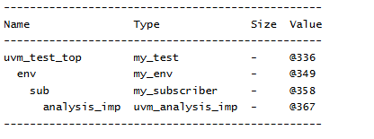

# UVM Components - UVM Subscriber Example
## Objective
The objective of this example is to understand the role of `uvm_subscriber` in a UVM verification
environment.
This example demonstrates how a subscriber is created and integrated into the UVM hierarchy.
---
## Concepts Covered
- `uvm_subscriber`
- `uvm_sequence_item`
- `write()`
- Transaction Reception
- `uvm_env`
- `uvm_test`
- UVM Hierarchy
---
## What is uvm_subscriber?
`uvm_subscriber` is a specialized UVM component used to receive and process transactions.
Subscribers are commonly used for:
- Functional Coverage Collection
- Transaction Analysis
- Statistics Gathering
- Protocol Checking
Subscribers are passive components and do not drive DUT signals.
---
## What is a Transaction?
A transaction is a high-level representation of DUT activity.
In this example, the transaction is represented by the `packet` class, which extends
`uvm_sequence_item`.
Transactions are typically generated by monitors and then sent to subscribers for analysis.
---
## Understanding the Example
A custom subscriber named `my_subscriber` is created by extending `uvm_subscriber`.
The subscriber is parameterized with the transaction type `packet`.
The environment creates the subscriber during the build phase, and the test creates the
environment.
The subscriber implements the `write()` method, which is called whenever a transaction is received.
After all components are created, the UVM hierarchy is displayed using `print_topology()`.
--
## Hierarchy Created
```text
uvm_test_top
 |
 +-- env
 |
 +-- sub
```
The subscriber becomes a child component of the environment.
---
## What is write()?
Every subscriber must implement the `write()` method.
```text
write(packet t)
```
This method is automatically called whenever a transaction is sent to the subscriber.
The received transaction can then be:
- Analyzed
- Logged
- Sampled for coverage
- Checked for protocol compliance
---
## Typical Transaction Flow
```text
Monitor
 |
 v
Analysis Port
 |
 v
Subscriber
```
A monitor observes DUT activity and sends transactions through an analysis port.
The subscriber receives those transactions through its `write()` method.
---
## Why Use Subscribers?
Subscribers separate transaction analysis from monitoring logic.
This improves:
- Reusability
- Maintainability
- Modularity
Multiple subscribers can receive the same transaction stream for different purposes.
---
## Class Hierarchy
```text
uvm_void
 |
uvm_object
 |
 +-- uvm_sequence_item
 | |
 | +-- packet
 |
uvm_report_object
 |
uvm_component
 |
 +-- uvm_test
 | |
 | +-- my_test
 |
 +-- uvm_env
 | |
 | +-- my_env
 |
 +-- uvm_subscriber #(packet)
 |
 +-- my_subscriber
```
---
## Simulation Output

---
## Key Takeaways
- `uvm_subscriber` receives transactions through the UVM analysis mechanism.
- Subscribers implement the `write()` method.
- Subscribers are commonly used for functional coverage collection.
- Subscribers are passive components and do not drive DUT signals.
- Subscribers improve modularity by separating analysis logic from monitoring logic.
- Transactions received by subscribers are typically generated by monitors.
---
