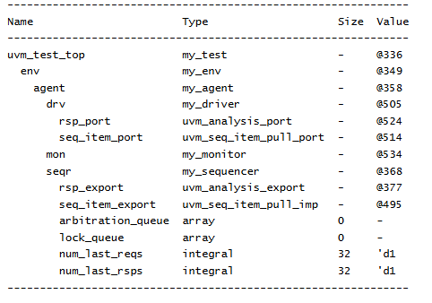

# UVM Components - UVM Sequencer Example
## Objective
The objective of this example is to understand the role of `uvm_sequencer` in a UVM verification
environment.
This example demonstrates how a sequencer is created inside an agent and how UVM builds a
hierarchical verification structure.
---
## Concepts Covered
- `uvm_sequencer`
- `uvm_driver`
- `uvm_monitor`
- `uvm_agent`
- `uvm_env`
- `uvm_test`
- Transaction Flow
- UVM Hierarchy
---
## What is uvm_sequencer?
`uvm_sequencer` is responsible for controlling the flow of transactions between sequences and
drivers.
The sequencer acts as an intermediary that receives transactions from sequences and forwards
them to the driver.
---
## Understanding the Example
A custom sequencer named `my_sequencer` is created by extending `uvm_sequencer`.
A custom driver named `my_driver` and a custom monitor named `my_monitor` are also created.
The agent creates the sequencer, driver, and monitor during the build phase.
The environment creates the agent, and the test creates the environment.
After all components are created, the hierarchy is displayed using `print_topology()`.
---
## Hierarchy Created
```text
uvm_test_top
 |
 +-- env
 |
 +-- agent
 |
 +-- seqr
 +-- drv
 +-- mon
```
The sequencer, driver, and monitor become child components of the agent.
---
## Why Do We Need a Sequencer?
A sequencer manages transaction flow between sequences and drivers.
Without a sequencer, there would be no standardized mechanism for controlling and forwarding
transactions.
The sequencer can also arbitrate between multiple sequences requesting access to the driver.
---
## Transaction Flow
```text
Sequence
|
 v
Sequencer
 |
 v
Driver
 |
 v
 DUT
 |
 v
Monitor
```
The sequence generates transactions, the sequencer forwards them to the driver, the driver drives
the DUT, and the monitor observes the DUT activity.
---
## Class Hierarchy
```text
uvm_void
 |
uvm_object
 |
uvm_report_object
 |
uvm_component
 |
 +-- uvm_test
 | |
 | +-- my_test
 |
 +-- uvm_env
 | |
 | +-- my_env
 |
 +-- uvm_agent
 | |
 | +-- my_agent
 |
 +-- uvm_sequencer
 | |
 | +-- my_sequencer
 |
+-- uvm_driver
 | |
 | +-- my_driver
 |
 +-- uvm_monitor
 |
 +-- my_monitor
```
---
## Simulation Output

---
## Key Takeaways
- `uvm_sequencer` controls transaction flow.
- Sequencers are typically created inside agents.
- Sequencers become child components of agents.
- Sequencers sit between sequences and drivers.
- Sequencers can arbitrate between multiple sequences.
- Sequencers are a core part of the UVM stimulus generation path.
---