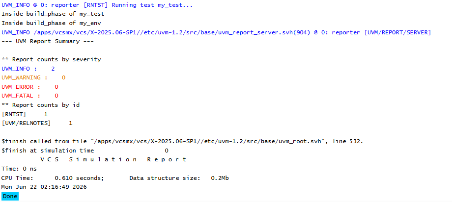

# UVM Phases - Build Phase Example
## Objective
The objective of this example is to understand the role of `build_phase()` in a UVM testbench.
This example demonstrates how components are created during the build phase and how UVM
automatically executes the build phase across the component hierarchy.
---
## Concepts Covered
- UVM Phases
- `build_phase`
- `uvm_test`
- `uvm_env`
- Component Creation
- Factory-Based Creation
- UVM Hierarchy
---
## What is build_phase()?
`build_phase()` is a build-time phase used to create and configure UVM components.
It executes before simulation starts and is commonly used to construct the verification environment
hierarchy.
The build phase is one of the most frequently used phases in UVM because almost all components
are created during this phase.
---
## Understanding the Example
A custom environment named `my_env` is created by extending `uvm_env`.
A custom test named `my_test` is created by extending `uvm_test`.
During the test's build phase, the environment is created using factory-based creation.
Both the test and environment implement `build_phase()` and display messages when the phase
executes.
This helps visualize the order in which UVM traverses the hierarchy.
---
## Hierarchy Created
```text
uvm_test_top
 |
 +-- env
```
The environment becomes a child component of the test.
---
## Why Use build_phase()?
The build phase is used to:
- Create components
- Configure components
- Construct the verification hierarchy
- Set configuration values
Typical examples include creating:
- Environments
- Agents
- Drivers
- Monitors
- Scoreboards
---
## Execution Flow
```text
run_test("my_test")
 |
 +-- Create my_test
 |
 +-- my_test.build_phase()
 |
 +-- Create env
 |
 +-- my_env.build_phase()
```
UVM automatically traverses the hierarchy and executes the build phase for all components.
---
## Simulation Output

---
## Key Takeaways
- `build_phase()` is used to create and configure UVM components.
- Components are typically created using `type_id::create()`.
- The build phase executes before simulation time starts.
- The build phase is a function phase and cannot consume simulation time.
- UVM automatically executes build phases across the hierarchy.
- Most component construction happens during the build phase.
---