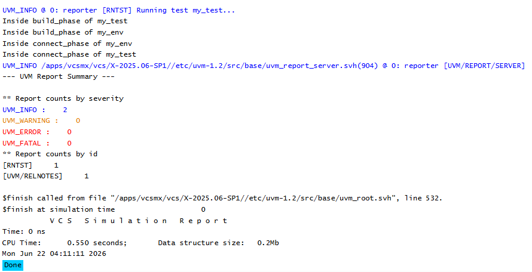

# UVM Phases - Connect Phase Example
## Objective
The objective of this example is to understand the role of `connect_phase()` in a UVM testbench.
This example demonstrates how UVM executes the build phase first and then transitions to the
connect phase.
---
## Concepts Covered
- UVM Phases
- `build_phase()`
- `connect_phase()`
- UVM Phase Order
- Component Creation
- Component Connections
---
## What is connect_phase()?
`connect_phase()` is a build-time phase that executes after `build_phase()`.
It is used to connect components that were previously created during the build phase.
Since all components already exist at this point, it is safe to establish connections between them.
---
## Understanding the Example
A custom environment (`my_env`) and a custom test (`my_test`) are created.
Both classes implement:
- `build_phase()`
- `connect_phase()`
Messages are displayed from each phase to observe the order in which UVM executes them.
This helps illustrate the transition from component creation to component connection.
---
## Phase Execution Order
```text
run_test()
 |
 +-- build_phase()
 |
 +-- connect_phase()
```
The build phase always executes before the connect phase.
---
## Why Use build_phase()?
The build phase is used to:
- Create components
- Configure components
- Build the UVM hierarchy
Typical examples:
- Environment creation
- Agent creation
- Driver creation
- Monitor creation
- Scoreboard creation
---
## Why Use connect_phase()?
The connect phase is used to connect previously created components.
Typical examples:
```text
Driver <-> Sequencer
Monitor -> Scoreboard
Monitor -> Subscriber
```
The connect phase ensures that all required components already exist before any connections are
made.
---
## Hierarchy Created
```text
uvm_test_top
 |
 +-- env
```
The environment becomes a child component of the test.
---
## Simulation Output

---
## Key Takeaways
- `connect_phase()` executes after `build_phase()`.
- Components should be created in `build_phase()`.
- Component connections should be made in `connect_phase()`.
- UVM follows a predefined phase execution order.
- The connect phase is commonly used for TLM and analysis port connections.
- Separating creation and connection improves testbench organization and readability.
---