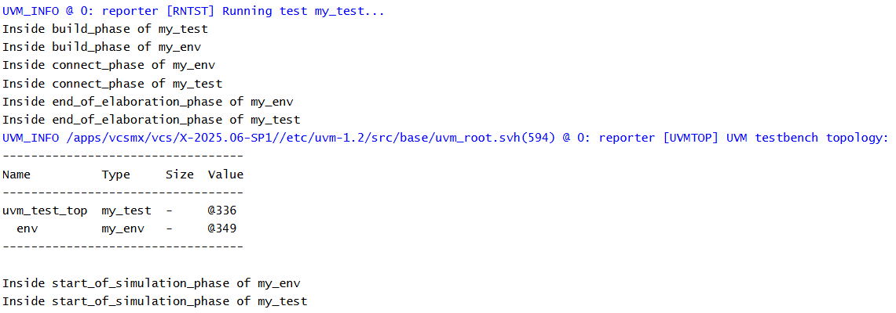

# UVM Phases - End of Elaboration Phase Example
## Objective
The objective of this example is to understand the role of `end_of_elaboration_phase()` in a UVM
testbench.
This example demonstrates how UVM executes the end of elaboration phase after component
creation and connection are complete.
---
## Concepts Covered
- UVM Phases
- `build_phase()`
- `connect_phase()`
- `end_of_elaboration_phase()`
- UVM Topology
- Hierarchy Verification
---
## What is end_of_elaboration_phase()?
`end_of_elaboration_phase()` executes after all components have been created and connected.
At this point, the UVM hierarchy is fully constructed and ready for simulation.
This phase is commonly used for hierarchy inspection and final configuration checks.
---
## Understanding the Example
A custom environment (`my_env`) and a custom test (`my_test`) are created.
Both classes implement:
- `build_phase()`
- `connect_phase()`
- `end_of_elaboration_phase()`
Messages are displayed from each phase to observe the phase execution order.
The test prints the complete UVM hierarchy using `uvm_top.print_topology()`.
---
## Phase Execution Order
```text
build_phase()
 |
 v
connect_phase()
 |
 v
end_of_elaboration_phase()
```
---
## Why Use end_of_elaboration_phase()?
This phase is commonly used to:
- Verify hierarchy creation
- Print topology
- Perform final configuration checks
- Validate testbench structure
---
## Hierarchy Created
```text
uvm_test_top
 |
 +-- env
```
---
## Simulation Output

---
## Key Takeaways
- `end_of_elaboration_phase()` executes after build and connect phases.
- The UVM hierarchy is fully constructed at this stage.
- `uvm_top.print_topology()` is commonly called in this phase.
- This phase is useful for hierarchy verification and debug.
- No simulation activity has started yet.
---
