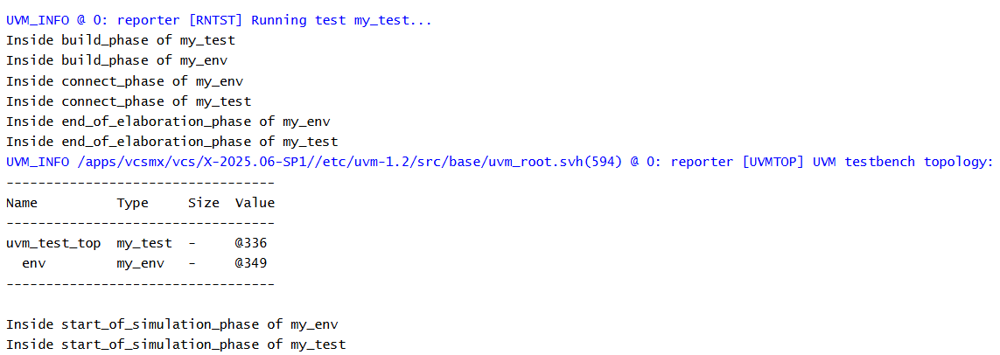

# UVM Phases - Start of Simulation Phase Example
## Objective
The objective of this example is to understand the role of `start_of_simulation_phase()` in a UVM
testbench.
This example demonstrates the final phase executed before runtime simulation begins.
---
## Concepts Covered
- UVM Phases
- `build_phase()`
- `connect_phase()`
- `end_of_elaboration_phase()`
- `start_of_simulation_phase()`
- UVM Phase Order
- Simulation Preparation
---
## What is start_of_simulation_phase()?
`start_of_simulation_phase()` executes after the hierarchy has been built, connected, and
elaborated.
This phase is the final preparation stage before runtime simulation begins.
At this point:
- All components have been created
- All connections have been established
- The hierarchy is finalized
- Simulation is ready to start
---
## Understanding the Example
A custom environment (`my_env`) and a custom test (`my_test`) are created.
Both classes implement:
- `build_phase()`
- `connect_phase()`
- `end_of_elaboration_phase()`
- `start_of_simulation_phase()`
Messages are displayed from each phase to observe the order in which UVM executes them.
The test also prints the UVM hierarchy during the end of elaboration phase.
---
## Phase Execution Order
```text
build_phase()
 |
 v
connect_phase()
 |
 v
end_of_elaboration_phase()
 |
 v
start_of_simulation_phase()
```
---
## Why Use start_of_simulation_phase()?
This phase is commonly used to:
- Display simulation startup information
- Print configuration summaries
- Enable debug features
- Confirm simulation readiness
- Log test configuration details
No actual stimulus is generated during this phase.
---
## Difference Between end_of_elaboration_phase() and start_of_simulation_phase()
### end_of_elaboration_phase()
Used for:
- Topology verification
- Hierarchy inspection
- Final configuration checks
### start_of_simulation_phase()
Used for:
- Startup messages
- Debug information
- Configuration reporting
- Simulation preparation
---
## Hierarchy Created
```text
uvm_test_top
 |
 +-- env
```
---
## Simulation Output

---
## Key Takeaways
- `start_of_simulation_phase()` executes after elaboration is complete.
- It is the final phase before runtime simulation begins.
- The hierarchy is fully constructed at this point.
- This phase is commonly used for reporting and debug information.
- No simulation activity or stimulus generation occurs in this phase.
- The next phase after this is `run_phase()`.
---