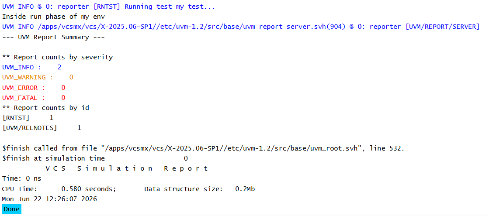

# UVM Phases - Run Phase Example

## Objective

The objective of this example is to understand the role of `run_phase()` in a UVM testbench.

This example demonstrates that the run phase is a task phase and can contain simulation delays.

---

## Concepts Covered

- UVM Phases
- `run_phase()`
- Task Phase
- Simulation Time
- Runtime Execution

---

## What is run_phase()?

`run_phase()` is the primary runtime phase in UVM.

Unlike build-time phases such as:

- `build_phase()`
- `connect_phase()`
- `end_of_elaboration_phase()`
- `start_of_simulation_phase()`

the run phase is a task phase and can consume simulation time.

Most verification activities occur during this phase.

Examples include:

- Stimulus generation
- Driving DUT signals
- Monitoring DUT activity
- Protocol checking

---

## Understanding the Example

A custom environment named `my_env` implements `run_phase()`.

A message is displayed when the run phase starts, followed by a delay of 10 time units and another display statement.

The purpose of this example is to demonstrate that delays are allowed inside the run phase.

---

## Phase Execution Order

```text
build_phase()
      |
      v
connect_phase()
      |
      v
end_of_elaboration_phase()
      |
      v
start_of_simulation_phase()
      |
      v
run_phase()
```

---

## Important Observation

In this example, no objections are raised.

As a result, UVM may end the simulation immediately after entering the run phase.

Therefore, the message displayed after the `#10` delay may never execute.

Example output:

```text
UVM_INFO @ 0: reporter [RNTST] Running test my_test...
Inside run_phase of my_env
```

Simulation ends at time 0 because no objections keep the run phase alive.

---

## Why Did the Delay Not Complete?

UVM uses objections to determine when simulation should continue.

Since no objection was raised:

```text
No Objections
      |
      v
Simulation Ends
```

The simulator terminates before the 10-time-unit delay completes.

---

## Hierarchy Created

```text
uvm_test_top
     |
     +-- env
```

---

## Simulation Output



---

## Key Takeaways

- `run_phase()` is a task phase.
- Delays and wait statements are allowed inside the run phase.
- Most verification activity occurs during the run phase.
- Simulation may end immediately if no objections are raised.
- Objections are required to keep simulation alive during runtime activity.
- Understanding objections is essential for effective UVM testbench development.

---

