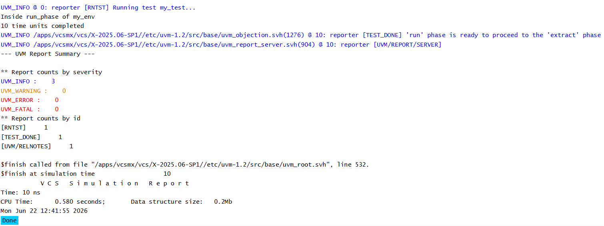

# UVM Phases - Run Phase Objections Example

## Objective

The objective of this example is to understand how objections control simulation execution in UVM.

This example demonstrates how `raise_objection()` and `drop_objection()` are used to keep the simulation running until all intended activity is completed.

---

## Concepts Covered

- UVM Phases
- `run_phase()`
- `raise_objection()`
- `drop_objection()`
- Simulation Lifetime Control
- Runtime Execution

---

## What are Objections?

Objections are UVM's mechanism for controlling simulation duration.

A component raises an objection when it has work to perform and drops the objection when its work is complete.

Simulation ends only when all active objections have been dropped.

---

## Why Do We Need Objections?

Without objections, UVM may terminate simulation immediately after entering the run phase.

As a result, delays, stimulus generation, and other runtime activities may never complete.

Objections allow components to explicitly tell UVM when simulation should continue and when it can safely end.

---

## Understanding the Example

The environment raises an objection at the beginning of the run phase.

A delay of 10 time units is executed to demonstrate that simulation time advances.

After the delay completes, the objection is dropped, allowing UVM to terminate the simulation.

This ensures that all intended runtime activity completes before simulation ends.

---

## Objection Flow

```text
raise_objection()
        |
        v
Simulation Continues
        |
        v
Runtime Activity
        |
        v
drop_objection()
        |
        v
Simulation Ends
```

---

## Runtime Sequence

```text
run_phase()
      |
      +-- raise_objection()
      |
      +-- Execute Runtime Activity
      |
      +-- drop_objection()
      |
      +-- Simulation Ends
```

---

## Why is run_phase() Different?

Unlike build-time phases, `run_phase()` is a task phase.

This means it can contain:

- Delays (`#10`)
- Wait statements
- Event synchronization
- Forever loops

Because simulation time advances during the run phase, objections are required to control when simulation should stop.

---

## Hierarchy Created

```text
uvm_test_top
     |
     +-- env
```

---

## Simulation Output



---

## Key Takeaways

- Objections control simulation lifetime in UVM.
- `raise_objection()` prevents simulation from ending.
- `drop_objection()` indicates completion of runtime activity.
- Simulation ends when all objections are dropped.
- Objections are most commonly used inside `run_phase()`.
- Understanding objections is essential for building practical UVM testbenches.
---

