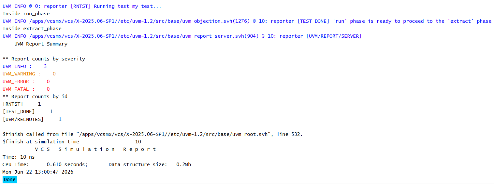

# UVM Phases - Extract Phase Example

## Objective

The objective of this example is to understand the role of `extract_phase()` in a UVM testbench.

This example demonstrates how UVM executes the extract phase after runtime simulation activity has completed.

---

## Concepts Covered

- UVM Phases
- `run_phase()`
- `extract_phase()`
- `raise_objection()`
- `drop_objection()`
- Runtime Completion
- Result Collection

---

## What is extract_phase()?

`extract_phase()` executes after the run phase has completed and all objections have been dropped.

At this point, simulation activity has finished and UVM begins collecting information generated during execution.

The extract phase is commonly used to gather statistics and prepare data for later checking and reporting.

---

## Understanding the Example

A custom environment implements both:

- `run_phase()`
- `extract_phase()`

The run phase raises an objection, executes for 10 time units, and then drops the objection.

Once runtime activity is complete, UVM automatically enters the extract phase.

A message is displayed from the extract phase to demonstrate its execution.

---

## Phase Execution Order

```text
run_phase()
      |
      v
extract_phase()
```

The extract phase begins only after all runtime activity has completed.

---

## Why Use extract_phase()?

The extract phase is commonly used to:

- Collect packet statistics
- Gather coverage information
- Extract scoreboard results
- Prepare pass/fail information
- Organize simulation data

Typical examples include:

- Total packets transmitted
- Total packets received
- Number of errors detected
- Coverage percentages

---

## Runtime Flow

```text
raise_objection()
        |
        v
run_phase()
        |
        v
drop_objection()
        |
        v
extract_phase()
```

---

## Hierarchy Created

```text
uvm_test_top
     |
     +-- env
```

---

## Simulation Output



---

## Key Takeaways

- `extract_phase()` executes after the run phase completes.
- Runtime activity has already finished before extract phase begins.
- This phase is used to collect and organize simulation results.
- Extracted information is often used by later phases such as `check_phase()` and `report_phase()`.
- The extract phase does not generate stimulus or drive DUT activity.

---