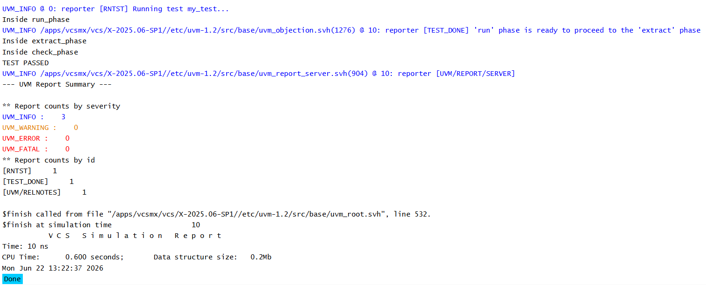

# UVM Phases - Check Phase Example

## Objective

The objective of this example is to understand the role of `check_phase()` in a UVM testbench.

This example demonstrates how UVM verifies simulation results after runtime activity has completed.

---

## Concepts Covered

- UVM Phases
- `run_phase()`
- `extract_phase()`
- `check_phase()`
- `raise_objection()`
- `drop_objection()`
- Pass/Fail Verification
- Result Validation

---

## What is check_phase()?

`check_phase()` executes after `extract_phase()`.

This phase is responsible for validating the results collected during simulation and determining whether the test passes or fails.

The check phase is commonly used to compare expected and actual results.

---

## Understanding the Example

The environment executes runtime activity during the run phase.

A packet count variable is assigned a value and retained after simulation activity completes.

During the extract phase, UVM transitions into result collection.

The check phase then verifies the packet count and determines whether the test passes or fails.

---

## Phase Execution Order

```text
run_phase()
      |
      v
extract_phase()
      |
      v
check_phase()
```

---

## Why Use check_phase()?

The check phase is commonly used to:

- Compare expected and actual values
- Verify scoreboard results
- Validate packet counts
- Check error statistics
- Determine overall test status

Typical examples include:

- Packets Sent vs Packets Received
- Expected Data vs Actual Data
- Coverage Goal Verification
- Error Count Verification

---

## Runtime Flow

```text
raise_objection()
        |
        v
run_phase()
        |
        v
drop_objection()
        |
        v
extract_phase()
        |
        v
check_phase()
        |
        v
PASS / FAIL Decision
```

---

## Hierarchy Created

```text
uvm_test_top
     |
     +-- env
```

---

## Simulation Output



---

## Key Takeaways

- `check_phase()` executes after `extract_phase()`.
- The check phase is responsible for result verification.
- Pass/fail decisions are commonly made in this phase.
- Runtime activity has already completed before the check phase begins.
- Check phase is frequently used with scoreboards and verification metrics.
- Proper result validation is a critical part of UVM verification.

---
