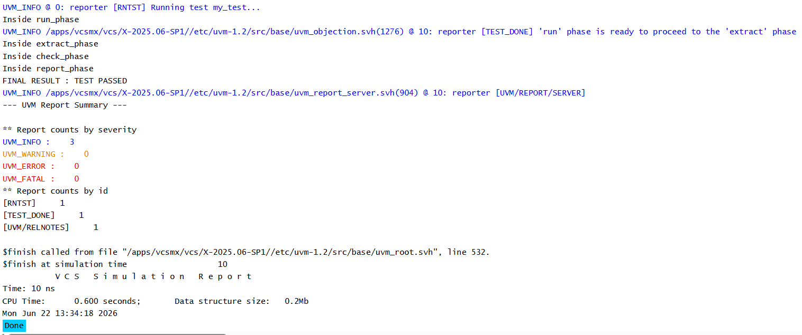

# UVM Phases - Report Phase Example

## Objective

The objective of this example is to understand the role of `report_phase()` in a UVM testbench.

This example demonstrates how UVM generates a final simulation summary after all verification activities have completed.

---

## Concepts Covered

- UVM Phases
- `run_phase()`
- `extract_phase()`
- `check_phase()`
- `report_phase()`
- Pass/Fail Reporting
- Simulation Summary

---

## What is report_phase()?

`report_phase()` executes after `check_phase()`.

This is typically the final phase of a UVM test.

The report phase is responsible for presenting the final verification results and simulation summary.

It commonly displays:

- Pass/Fail status
- Coverage information
- Packet statistics
- Error counts
- Verification summaries

---

## Understanding the Example

The environment performs runtime activity during the run phase and assigns a value to `packet_count`.

The extract phase executes after simulation activity completes.

The check phase verifies whether the expected packet count was observed and determines the test status.

Finally, the report phase displays the overall result of the test.

---

## Phase Execution Order

```text
run_phase()
      |
      v
extract_phase()
      |
      v
check_phase()
      |
      v
report_phase()
```

---

## Why Use report_phase()?

The report phase is commonly used to:

- Display final pass/fail status
- Print simulation statistics
- Display coverage summaries
- Generate verification reports
- Summarize test execution

---

## Difference Between check_phase() and report_phase()

### check_phase()

Used to:

- Verify collected data
- Compare expected and actual results
- Determine pass/fail status

### report_phase()

Used to:

- Display final results
- Print summaries and statistics
- Present verification outcomes

---

## Runtime Flow

```text
run_phase()
        |
        v
extract_phase()
        |
        v
check_phase()
        |
        +--> Determine PASS / FAIL
        |
        v
report_phase()
        |
        +--> Display Final Result
```

---

## Hierarchy Created

```text
uvm_test_top
     |
     +-- env
```

---

## Simulation Output



---

## Key Takeaways

- `report_phase()` executes after `check_phase()`.
- It is responsible for displaying final verification results.
- Pass/fail decisions are typically made in `check_phase()`.
- Report phase presents the final simulation summary.
- This phase is commonly used for statistics and coverage reporting.
- `report_phase()` is usually the last user-defined phase executed in a UVM test.

---

