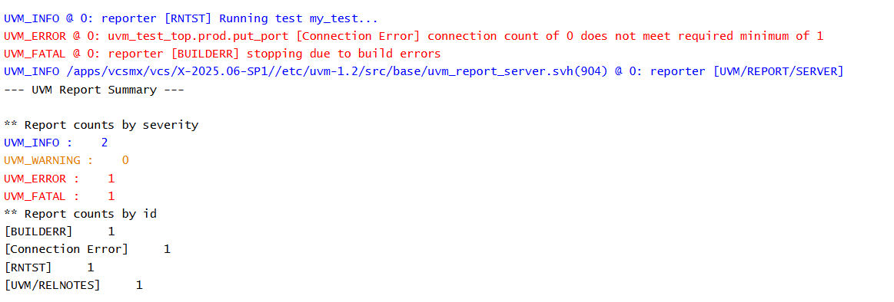

# UVM TLM - Blocking Put Port Example

## Objective

The objective of this example is to understand the declaration and creation of a `uvm_blocking_put_port`.

This is the first step in learning Blocking Put communication in UVM.

---

## Concepts Covered

- UVM TLM
- `uvm_blocking_put_port`
- Producer Component
- TLM Port Creation
- Build Phase

---

## What is a Blocking Put Port?

A blocking put port is a TLM communication port used by a producer component to send transactions.

The producer uses this port to communicate with another component through a matching blocking put implementation.

At this stage, the port is only created and is not connected to any receiver.

---

## Understanding the Example

A producer component declares a `uvm_blocking_put_port` capable of sending integer data.

The port is created during the build phase.

A custom test creates the producer component and prints the UVM hierarchy.

No transaction transfer occurs because a receiver has not yet been implemented.

---

## Communication Structure

```text
Producer
   |
Blocking Put Port
```

This example introduces only the sender side of Blocking Put communication.

---

## Why Create the Port?

Before a producer can send transactions, it must first create a communication interface.

The blocking put port serves as that interface.

In later examples, this port will be connected to a matching blocking put implementation.

---

## Hierarchy Created

```text
uvm_test_top
     |
     +-- prod
```

---

## Simulation Output



---

## Key Takeaways

- `uvm_blocking_put_port` represents the sender side of Blocking Put communication.
- The port is typically created during the build phase.
- No data transfer occurs until a matching receiver is connected.
- This example focuses only on understanding the producer side of the communication.
---    


