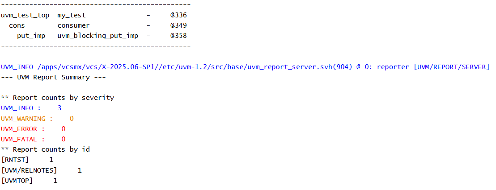

# UVM TLM - Blocking Put Implementation Example

## Objective

The objective of this example is to understand the receiver side of Blocking Put communication using `uvm_blocking_put_imp`.

This example demonstrates how a consumer component declares a blocking put implementation and provides a `put()` method to receive transactions.

---

## Concepts Covered

- UVM TLM
- `uvm_blocking_put_imp`
- Consumer Component
- TLM Receiver
- `put()` Method
- Build Phase

---

## What is a Blocking Put Implementation?

A blocking put implementation (`uvm_blocking_put_imp`) represents the receiver side of Blocking Put communication.

It accepts transactions sent by a producer through a matching blocking put port.

The receiver must implement the `put()` method, which is automatically executed whenever a transaction arrives.

---

## Understanding the Example

A consumer component declares a `uvm_blocking_put_imp` capable of receiving integer transactions.

The implementation is created during the build phase.

A `put()` task is defined to process incoming data.

Since no producer is connected, no transactions are received in this example.

---

## Communication Structure

```text
Blocking Put Implementation
          |
          v
      Consumer
```

This example focuses only on the receiver side of Blocking Put communication.

---

## Why is the put() Method Required?

Whenever a producer sends data through a blocking put port, UVM automatically invokes the consumer's `put()` method.

The `put()` method defines how the received transaction should be processed.

---

## Hierarchy Created

```text
uvm_test_top
     |
     +-- cons
```

---

## Simulation Output



---

## Key Takeaways

- `uvm_blocking_put_imp` represents the receiver side of Blocking Put communication.
- The implementation is created during the build phase.
- Every blocking put implementation must define a `put()` method.
- The `put()` method executes automatically when data is received.
- No transaction transfer occurs until a producer is connected.

---


