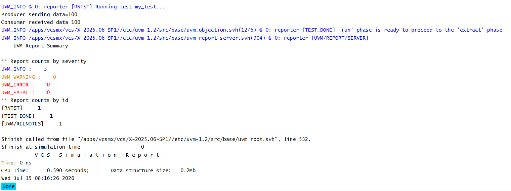

# UVM TLM - Blocking Put Connection Example

## Objective

The objective of this example is to understand how a producer and consumer communicate using a Blocking Put connection in UVM.

This example demonstrates how a blocking put port is connected to a blocking put implementation and how data is transferred between components.

---

## Concepts Covered

- UVM TLM
- `uvm_blocking_put_port`
- `uvm_blocking_put_imp`
- `connect_phase()`
- Producer Component
- Consumer Component
- Transaction Transfer

---

## What is a Blocking Put Connection?

A Blocking Put connection establishes communication between a producer and a consumer.

The producer sends transactions through a blocking put port.

The consumer receives transactions through a blocking put implementation.

The connection between them is created during the `connect_phase()`.

---

## Understanding the Example

The producer creates a blocking put port.

The consumer creates a blocking put implementation and defines the `put()` method.

During the connect phase, the producer's port is connected to the consumer's implementation.

During the run phase, the producer sends an integer value.

The consumer automatically receives the value through its `put()` method.

---

## Communication Flow

```text
Producer
    |
put_port.put(100)
    |
    v
Blocking Put Port
    |
connect()
    |
Blocking Put Implementation
    |
Consumer.put(100)
```

---

## Data Flow

```text
Producer
    |
100
    |
Blocking Put Port
    |
Connection
    |
Blocking Put Implementation
    |
Consumer
```

---

## Why is connect_phase() Used?

The `connect_phase()` is responsible for connecting TLM ports and implementations after all components have been created in the build phase.

Without this connection, the producer and consumer cannot communicate.

---

## Hierarchy Created

```text
uvm_test_top
     |
     +-- prod
     |
     +-- cons
```

---

## Simulation Output



---

## Key Takeaways

- `uvm_blocking_put_port` is used by the producer to send transactions.
- `uvm_blocking_put_imp` is used by the consumer to receive transactions.
- `connect_phase()` establishes the communication path.
- The `put()` method is automatically called when data is sent.
- Blocking Put provides one-to-one communication between UVM components.

---


