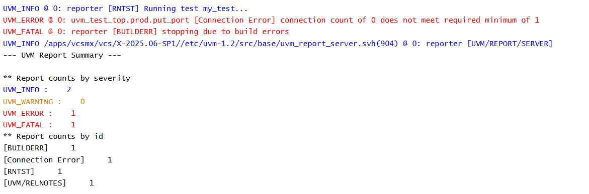

# UVM TLM - Nonblocking Put Port Example

## Objective

The objective of this example is to understand the declaration and creation of a `uvm_nonblocking_put_port`.

This is the first step in learning Nonblocking Put communication in UVM.

---

## Concepts Covered

- UVM TLM
- `uvm_nonblocking_put_port`
- Producer Component
- TLM Port Creation
- Build Phase

---

## What is a Nonblocking Put Port?

A nonblocking put port is a TLM communication port used by a producer component to send transactions without waiting for the receiver.

Unlike a blocking put port, the producer can continue execution even if the receiver is not ready to accept the transaction.

The producer typically uses methods such as:

- `can_put()`
- `try_put()`

to perform nonblocking communication.

---

## Understanding the Example

A producer component declares a `uvm_nonblocking_put_port` capable of sending integer data.

The port is created during the build phase.

A custom test creates the producer component and prints the UVM hierarchy.

No receiver is connected in this example, so no transaction transfer occurs.

The purpose of this example is to understand how a nonblocking put port is declared and instantiated.

---

## Communication Structure

```text
Producer
    |
Nonblocking Put Port
```

This example introduces only the sender side of Nonblocking Put communication.

---

## Why Create the Port?

Before a producer can send transactions using Nonblocking Put communication, it must first create a communication interface.

The nonblocking put port serves as that interface.

In the following examples, this port will be connected to a matching nonblocking put implementation.

---

## Hierarchy Created

```text
uvm_test_top
     |
     +-- prod
```

---

## Simulation Output



---

## Key Takeaways

- `uvm_nonblocking_put_port` represents the sender side of Nonblocking Put communication.
- The port is typically created during the build phase.
- No transaction transfer occurs until a matching receiver is connected.
- Nonblocking communication allows the producer to continue execution without waiting for the receiver.
- This example focuses only on understanding the producer side of the communication.

---

