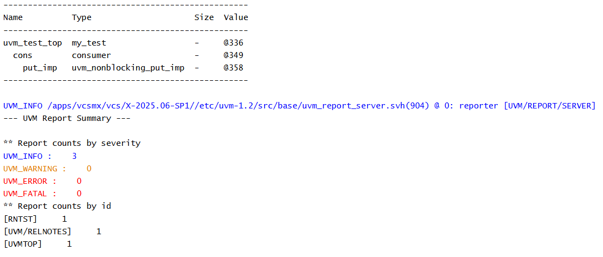

# UVM TLM - Nonblocking Put Implementation Example

## Objective

The objective of this example is to understand the receiver side of Nonblocking Put communication using `uvm_nonblocking_put_imp`.

This example demonstrates how a consumer declares a nonblocking put implementation and implements the methods required to receive transactions.

---

## Concepts Covered

- UVM TLM
- `uvm_nonblocking_put_imp`
- Consumer Component
- `can_put()`
- `try_put()`
- Build Phase

---

## What is a Nonblocking Put Implementation?

A nonblocking put implementation (`uvm_nonblocking_put_imp`) represents the receiver side of Nonblocking Put communication.

It accepts transactions from a producer through a matching nonblocking put port.

Unlike Blocking Put, the receiver supports nonblocking communication using `can_put()` and `try_put()`.

---

## Understanding the Example

A consumer component declares a `uvm_nonblocking_put_imp` capable of receiving integer transactions.

The implementation is created during the build phase.

The `can_put()` method indicates whether the consumer is ready to receive data.

The `try_put()` method processes the incoming transaction and returns whether the transfer was successful.

Since no producer is connected, neither method is invoked during simulation.

---

## Communication Structure

```text
Nonblocking Put Implementation
            |
            v
        Consumer
```

This example focuses only on the receiver side of Nonblocking Put communication.

---

## Why are can_put() and try_put() Needed?

`can_put()` allows the producer to determine whether the receiver is ready.

`try_put()` attempts to send a transaction without waiting.

This enables nonblocking communication between UVM components.

---

## Hierarchy Created

```text
uvm_test_top
     |
     +-- cons
```

---

## Simulation Output



---

## Key Takeaways

- `uvm_nonblocking_put_imp` represents the receiver side of Nonblocking Put communication.
- `can_put()` indicates whether the receiver is ready.
- `try_put()` attempts to receive a transaction.
- Nonblocking communication allows the sender to continue execution immediately.
- No transaction transfer occurs until a producer is connected.

---

