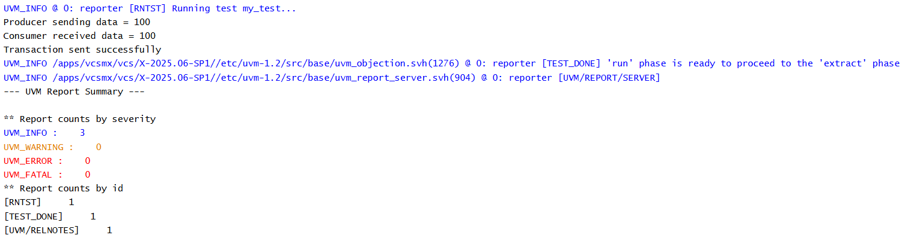

# UVM TLM - Nonblocking Put Connection Example

## Objective

The objective of this example is to understand how a producer and consumer communicate using a Nonblocking Put connection.

This example demonstrates how a nonblocking put port is connected to a nonblocking put implementation and how transactions are transferred without blocking the sender.

---

## Concepts Covered

- UVM TLM
- `uvm_nonblocking_put_port`
- `uvm_nonblocking_put_imp`
- `can_put()`
- `try_put()`
- `connect_phase()`
- Producer Component
- Consumer Component

---

## What is a Nonblocking Put Connection?

A Nonblocking Put connection enables communication between a producer and a consumer without forcing the producer to wait.

Before sending data, the producer checks whether the receiver is ready using `can_put()`.

If the receiver is ready, the producer attempts the transfer using `try_put()`.

---

## Understanding the Example

The producer creates a nonblocking put port.

The consumer creates a nonblocking put implementation and defines both `can_put()` and `try_put()`.

During the connect phase, the producer's port is connected to the consumer's implementation.

During the run phase:

1. The producer checks if the consumer is ready.
2. The producer attempts to send the transaction.
3. The consumer receives the transaction.
4. The producer continues execution immediately.

---

## Communication Flow

```text
Producer
    |
can_put()
    |
Receiver Ready?
    |
try_put(100)
    |
Nonblocking Put Port
    |
Connection
    |
Nonblocking Put Implementation
    |
Consumer.try_put(100)
```

---

## Why Use can_put()?

`can_put()` allows the producer to determine whether the receiver can accept a transaction before attempting the transfer.

---

## Why Use try_put()?

`try_put()` attempts to send the transaction without blocking.

It returns:

- `1` → Transaction accepted
- `0` → Transaction rejected

---

## Hierarchy Created

```text
uvm_test_top
     |
     +-- prod
     |
     +-- cons
```

---

## Simulation Output



---

## Key Takeaways

- `uvm_nonblocking_put_port` is used by the producer.
- `uvm_nonblocking_put_imp` is used by the consumer.
- `can_put()` checks receiver availability.
- `try_put()` attempts the transaction.
- The producer never waits for the receiver.
- Nonblocking Put is useful when the sender must continue execution regardless of the receiver's state.
---
