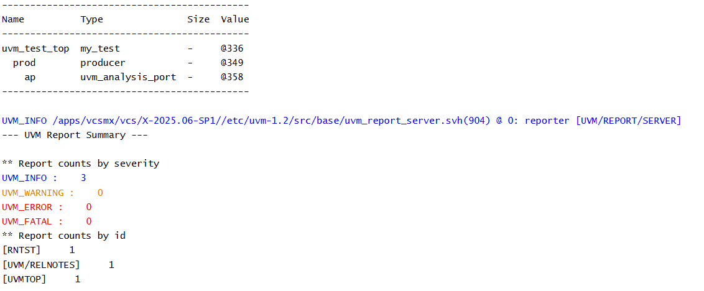

# UVM TLM - Analysis Port Example

## Objective

The objective of this example is to understand the declaration and creation of a `uvm_analysis_port`.

This is the first step in learning Analysis Port communication in UVM.

---

## Concepts Covered

- UVM TLM
- `uvm_analysis_port`
- Producer Component
- Broadcast Communication
- Build Phase

---

## What is an Analysis Port?

An Analysis Port is a TLM communication port used to broadcast transactions from one component to one or more receiving components.

Unlike Blocking Put and Nonblocking Put, an Analysis Port supports one-to-many communication.

The sender simply writes a transaction, and every connected receiver automatically receives it.

---

## Understanding the Example

A producer component declares a `uvm_analysis_port` capable of sending integer transactions.

The analysis port is created during the build phase.

A custom test creates the producer component and prints the UVM hierarchy.

No receivers are connected in this example, so no transaction transfer occurs.

The purpose of this example is to understand how an Analysis Port is declared and instantiated.

---

## Communication Structure

```text
Producer
    |
Analysis Port
```

This example introduces only the sender side of Analysis Port communication.

---

## Why Create an Analysis Port?

Before a component can broadcast transactions, it must first create an Analysis Port.

In later examples, this port will be connected to one or more Analysis Implementations.

---

## Hierarchy Created

```text
uvm_test_top
     |
     +-- prod
```

---

## Simulation Output



---

## Key Takeaways

- `uvm_analysis_port` represents the sender side of Analysis communication.
- Analysis Ports support one-to-many communication.
- The port is typically created during the build phase.
- No transaction transfer occurs until one or more receivers are connected.
- Analysis Ports are widely used inside UVM monitors.

---

