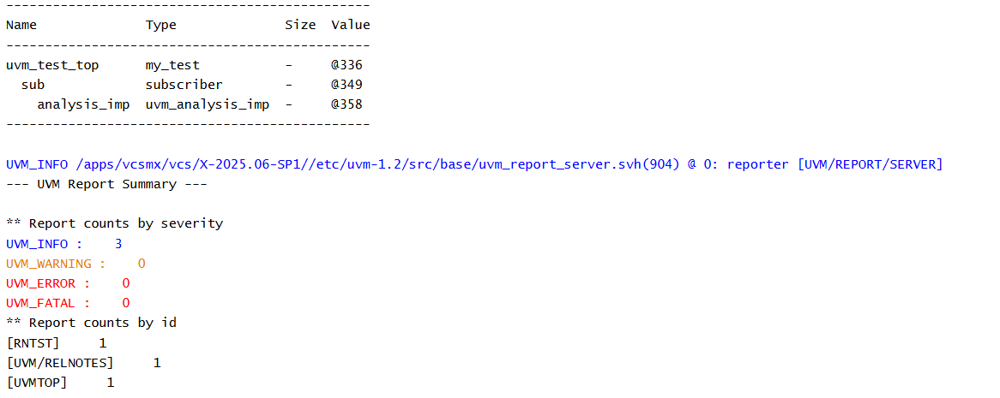

# UVM TLM - Analysis Implementation Example

## Objective

The objective of this example is to understand the receiver side of Analysis communication using `uvm_analysis_imp`.

This example demonstrates how a subscriber declares an Analysis Implementation and implements the `write()` method to receive transactions.

---

## Concepts Covered

- UVM TLM
- `uvm_analysis_imp`
- Subscriber Component
- `write()` Method
- Build Phase

---

## What is an Analysis Implementation?

An Analysis Implementation (`uvm_analysis_imp`) represents the receiver side of Analysis communication.

It receives transactions broadcast by a matching Analysis Port.

Every Analysis Implementation must define a `write()` method, which is automatically called whenever a transaction is received.

---

## Understanding the Example

A subscriber component declares a `uvm_analysis_imp` capable of receiving integer transactions.

The implementation is created during the build phase.

A `write()` function is implemented to process incoming transactions.

Since no Analysis Port is connected, no transactions are received in this example.

The purpose of this example is to understand how an Analysis Implementation is declared and instantiated.

---

## Communication Structure

```text
Analysis Implementation
          |
          v
      Subscriber
```

This example introduces only the receiver side of Analysis communication.

---

## Why is the write() Method Required?

Whenever an Analysis Port broadcasts a transaction using:

```text
ap.write(data)
```

UVM automatically invokes:

```text
write(data)
```

inside every connected Analysis Implementation.

The `write()` method defines how the received transaction is processed.

---

## Hierarchy Created

```text
uvm_test_top
     |
     +-- sub
```

---

## Simulation Output



---

## Key Takeaways

- `uvm_analysis_imp` represents the receiver side of Analysis communication.
- Every Analysis Implementation must implement a `write()` method.
- The `write()` method is automatically executed when a transaction is received.
- No transaction transfer occurs until an Analysis Port is connected.
- Analysis Implementations are commonly used in subscribers, scoreboards, and coverage collectors.

---
