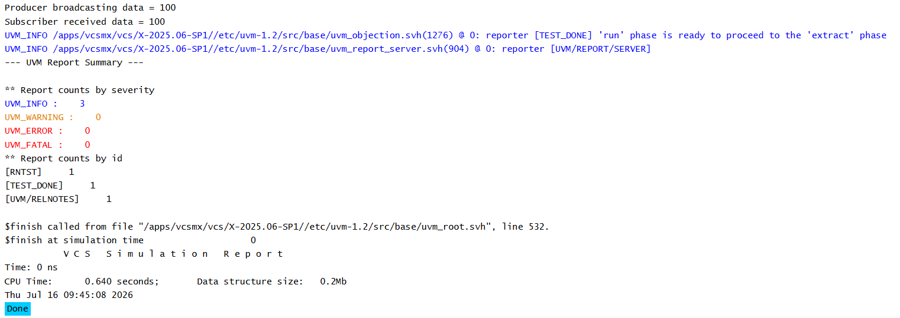

# UVM TLM - Analysis Port Connection Example

## Objective

The objective of this example is to understand how an Analysis Port communicates with an Analysis Implementation.

This example demonstrates how a transaction is broadcast from a producer to a subscriber using Analysis TLM communication.

---

## Concepts Covered

- UVM TLM
- `uvm_analysis_port`
- `uvm_analysis_imp`
- `write()` Method
- `connect_phase()`
- Broadcast Communication

---

## What is an Analysis Connection?

An Analysis Connection links an Analysis Port (sender) to an Analysis Implementation (receiver).

The sender broadcasts transactions using the `write()` method.

Every connected receiver automatically receives the transaction through its own `write()` method.

---

## Understanding the Example

The producer creates an Analysis Port.

The subscriber creates an Analysis Implementation and implements the `write()` function.

During the `connect_phase()`, the Analysis Port is connected to the Analysis Implementation.

During the `run_phase()`, the producer broadcasts an integer transaction.

The subscriber automatically receives the transaction and displays it.

---

## Communication Flow

```text
Producer
    |
ap.write(100)
    |
Analysis Port
    |
connect()
    |
Analysis Implementation
    |
Subscriber.write(100)
```

---

## Why Use Analysis Ports?

Analysis Ports allow one component to broadcast the same transaction to multiple receivers.

This makes them ideal for monitors, which often need to send transactions to:

- Scoreboards
- Subscribers
- Coverage Collectors

without knowing how many receivers are connected.

---

## Hierarchy Created

```text
uvm_test_top
     |
     +-- prod
     |
     +-- sub
```

---

## Simulation Output



---

## Key Takeaways

- `uvm_analysis_port` broadcasts transactions.
- `uvm_analysis_imp` receives broadcast transactions.
- `connect_phase()` establishes the communication path.
- The `write()` method is automatically called for every received transaction.
- Analysis communication supports one-to-many communication.

---
