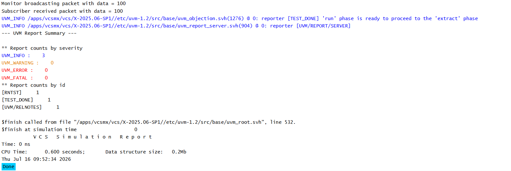

# UVM TLM - Monitor to Subscriber Communication

## Objective

The objective of this example is to demonstrate how a UVM monitor communicates with a subscriber using an Analysis Port.

This example represents one of the most common communication patterns used in real UVM verification environments.

---

## Concepts Covered

- UVM Monitor
- UVM Subscriber
- `uvm_analysis_port`
- `uvm_subscriber`
- Packet Broadcasting
- Analysis Communication

---

## Why Do Monitors Use Analysis Ports?

A monitor observes activity on the DUT and converts signal-level activity into transactions.

These transactions often need to be shared with multiple verification components such as:

- Scoreboard
- Subscriber
- Coverage Collector

Instead of communicating with each component individually, the monitor broadcasts the transaction through an Analysis Port.

---

## Understanding the Example

A monitor creates an Analysis Port capable of broadcasting packet transactions.

During the run phase, the monitor creates a packet, assigns a value, and broadcasts it.

A subscriber receives the packet through its `write()` method and displays the packet data.

---

## Communication Flow

```text
Monitor
    |
Create Packet
    |
Analysis Port
    |
analysis_export
    |
Subscriber
```

---

## Why Use `uvm_subscriber`?

`uvm_subscriber` is a specialized UVM component designed to receive transactions through Analysis communication.

It already provides an `analysis_export`, so only the `write()` function needs to be implemented.

---

## Hierarchy Created

```text
uvm_test_top
     |
     +-- env
          |
          +-- mon
          |
          +-- sub
```

---

## Simulation Output



---

## Key Takeaways

- Monitors commonly use `uvm_analysis_port` to broadcast transactions.
- Subscribers receive transactions by implementing the `write()` method.
- One monitor can broadcast the same transaction to multiple receivers.
- This communication pattern is widely used in real UVM verification environments.

---

