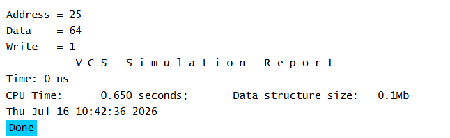

# UVM Sequences - Sequence Item Example

## Objective

The objective of this example is to understand how to create a `uvm_sequence_item`, which represents a transaction in UVM.

A sequence item groups together all the information required for a single transaction and serves as the basic unit of communication in a UVM testbench.

---

## Concepts Covered

- `uvm_sequence_item`
- Transaction Object
- UVM Factory Registration
- Random Fields
- Object Creation

---

## What is a Sequence Item?

A sequence item is a transaction object that contains all the information required to perform a single operation on the DUT.

Instead of passing multiple variables individually, UVM groups related information into a single object.

For example, a memory write transaction may include:

- Address
- Data
- Write Enable

These fields together form one sequence item.

---

## Understanding the Example

A class named `packet` extends `uvm_sequence_item`.

The packet contains three random fields:

- Address
- Data
- Write Control

The packet is registered with the UVM factory using the `uvm_object_utils` macro.

Inside the testbench, a packet object is created using the factory, values are assigned to its fields, and the transaction is displayed.

---

## Transaction Structure

```text
Packet
│
├── Address
├── Data
└── Write
```

---

## Why Use a Sequence Item?

A sequence item keeps all transaction information together in a single object.

This object can be generated by sequences, transferred through sequencers, driven by drivers, monitored by monitors, and checked by scoreboards.

Using a single transaction object improves readability, modularity, and reusability.

---

## Simulation Output



---

## Key Takeaways

- `uvm_sequence_item` represents a single transaction.
- Multiple related fields are grouped into one object.
- Sequence items are registered with the UVM factory.
- They are the foundation of sequence-based stimulus generation in UVM.
- Every sequence generates one or more sequence items.

---

