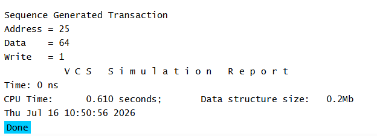

# UVM Sequences - Sequence Example

## Objective

The objective of this example is to understand how to create a `uvm_sequence` that generates sequence items.

A sequence is responsible for creating one or more transactions and preparing them to be sent to the sequencer.

---

## Concepts Covered

- `uvm_sequence`
- `body()` Task
- Sequence Item Creation
- Transaction Generation
- UVM Factory Registration

---

## What is a Sequence?

A sequence is a UVM object responsible for generating transactions.

Instead of creating transactions inside the driver, UVM uses sequences to generate sequence items.

This separation makes the verification environment more modular and reusable.

---

## Understanding the Example

A class named `my_sequence` extends `uvm_sequence`.

Inside the `body()` task:

- A packet object is created.
- Values are assigned to its fields.
- The generated transaction is displayed.

For simplicity, the `body()` task is called directly in this example.

In a real UVM environment, the sequence is started using a sequencer.

---

## Communication Flow

```text
Sequence
    |
Creates Packet
    |
Generated Transaction
```

---

## Why Use the body() Task?

The `body()` task contains the transaction generation logic.

Whenever a sequence starts, UVM automatically executes the `body()` task.

This task can generate one or more transactions depending on the verification scenario.

---

## Simulation Output



---

## Key Takeaways

- `uvm_sequence` generates sequence items.
- The `body()` task contains the transaction generation logic.
- A sequence can generate one or many transactions.
- In a complete UVM testbench, sequences are started by a sequencer.
- Separating transaction generation from the driver improves code reusability.

---

