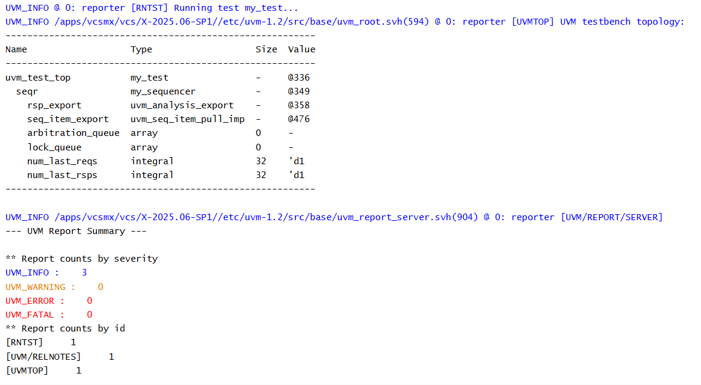

# UVM Sequences - Sequencer Example

## Objective

The objective of this example is to understand how to create a UVM Sequencer.

A sequencer acts as an intermediary between a sequence and a driver. It receives transactions generated by sequences and forwards them to the driver.

---

## Concepts Covered

- `uvm_sequencer`
- Sequence-to-Driver Communication
- Transaction Flow
- Build Phase
- UVM Factory Registration

---

## What is a Sequencer?

A sequencer is a UVM component responsible for coordinating the flow of transactions from one or more sequences to a driver.

It does not generate transactions itself. Instead, it receives sequence items from sequences and delivers them to the driver in the appropriate order.

---

## Understanding the Example

A class named `my_sequencer` extends `uvm_sequencer`.

The sequencer is parameterized with the `packet` transaction type.

During the build phase, the test creates the sequencer using the UVM factory.

The topology is printed to confirm that the sequencer has been instantiated successfully.

---

## Communication Flow

```text
Sequence
    |
    v
Sequencer
    |
    v
Driver
```

The sequencer acts as the communication bridge between sequences and the driver.

---

## Why Use a Sequencer?

A sequencer manages the flow of transactions generated by sequences.

It ensures that the driver receives transactions in the correct order and allows multiple sequences to share the same driver.

---

## Hierarchy Created

```text
uvm_test_top
     |
     +-- seqr
```

---

## Simulation Output



---

## Key Takeaways

- `uvm_sequencer` is a UVM component.
- It acts as the bridge between sequences and the driver.
- It does not generate transactions.
- It forwards sequence items to the driver.
- A sequencer can manage transactions from multiple sequences.

---

