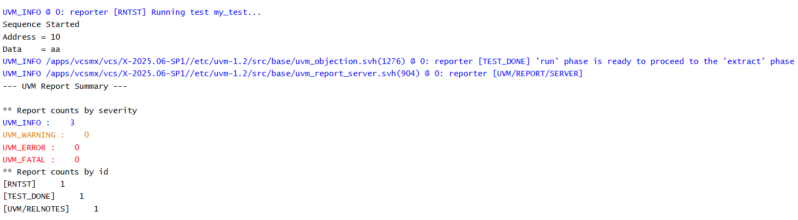

# UVM Sequences - Starting a Sequence

## Objective

The objective of this example is to understand how to start a sequence using the `start()` method.

Unlike earlier examples where the `body()` task was called directly for learning purposes, this example demonstrates the standard UVM approach of executing a sequence through a sequencer.

---

## Concepts Covered

- `uvm_sequence`
- `uvm_sequencer`
- `start()`
- `body()`
- Sequence Execution

---

## What is `start()`?

The `start()` method begins the execution of a sequence.

It associates the sequence with a sequencer and automatically invokes the `body()` task.

The user does not call `body()` directly.

---

## Understanding the Example

A sequence creates a packet inside its `body()` task.

A sequencer is created in the test.

During the `run_phase()`, the sequence is started using:

```systemverilog
seq.start(seqr);
```

This causes UVM to execute the sequence's `body()` task automatically.

The generated packet is then displayed.

---

## Execution Flow

```text
Sequence
    |
start(seqr)
    |
Sequencer
    |
body()
    |
Packet Created
```

---

## Why Use `start()`?

Using `start()` follows the standard UVM sequence execution flow.

It ensures that sequences communicate correctly with the sequencer and prepares them for interaction with the driver.

---

## Simulation Output



---

## Key Takeaways

- A sequence should be started using `start()`.
- `start()` automatically invokes the `body()` task.
- The sequencer coordinates sequence execution.
- Directly calling `body()` is useful only for simple learning examples.

---

