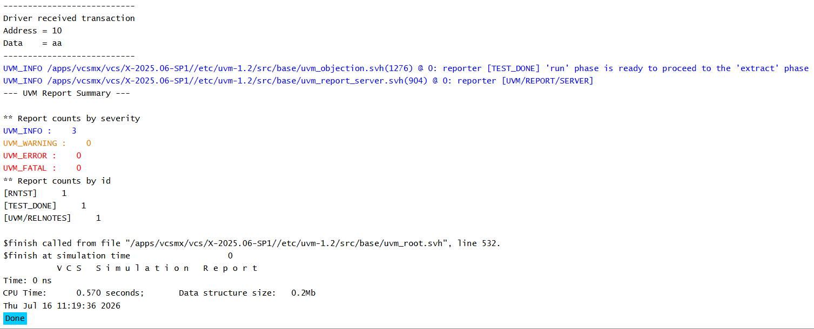

# UVM Sequences - Complete Sequence Flow

## Objective

The objective of this example is to demonstrate the complete flow of a transaction through a UVM testbench.

The example combines the sequence, sequencer, driver, agent, environment, and test into a complete working verification flow.

---

## Concepts Covered

- `uvm_sequence_item`
- `uvm_sequence`
- `uvm_sequencer`
- `uvm_driver`
- `start_item()`
- `finish_item()`
- `get_next_item()`
- `item_done()`
- Driver-Sequencer Handshake

---

## Complete Transaction Flow

```text
Sequence
    |
start_item(pkt)
    |
Fill Transaction
    |
finish_item(pkt)
    |
Sequencer
    |
get_next_item()
    |
Driver
    |
Drive Transaction
    |
item_done()
```

---

## Understanding the Example

A sequence creates a packet transaction.

The sequence calls `start_item()` to begin the transaction and `finish_item()` after filling the packet fields.

The sequencer forwards the transaction to the driver.

The driver retrieves the transaction using `get_next_item()`, processes it, and then calls `item_done()` to indicate completion.

---

## Why Use start_item() and finish_item()?

These methods synchronize the sequence with the sequencer.

They ensure that the transaction is properly transferred before the driver requests it.

---

## Why Use get_next_item() and item_done()?

These methods synchronize the driver with the sequencer.

The driver requests a transaction using `get_next_item()` and signals completion using `item_done()`.

---

## Complete Component Hierarchy

```text
uvm_test_top
     |
     +-- env
          |
          +-- agent
               |
               +-- seqr
               |
               +-- drv
```

---

## Simulation Output



---

## Key Takeaways

- `start_item()` begins a transaction.
- `finish_item()` completes the transaction.
- The sequencer forwards transactions to the driver.
- The driver retrieves transactions using `get_next_item()`.
- The driver calls `item_done()` after processing.
- This represents the standard UVM sequence execution flow.

---

